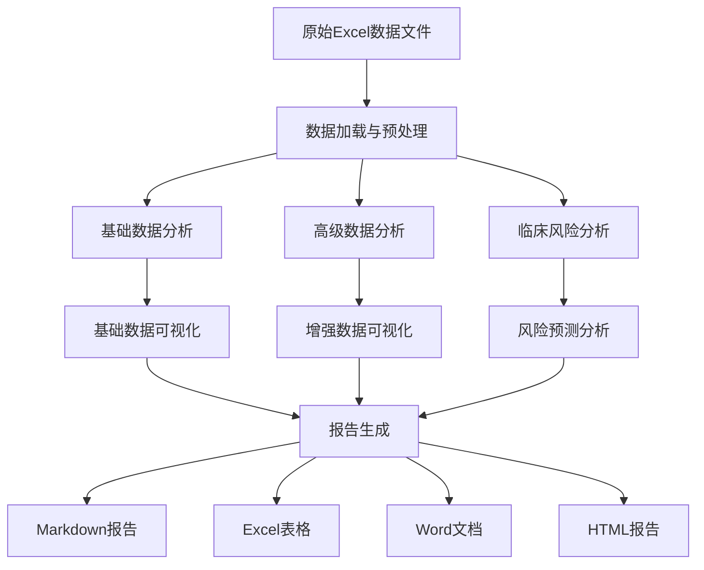
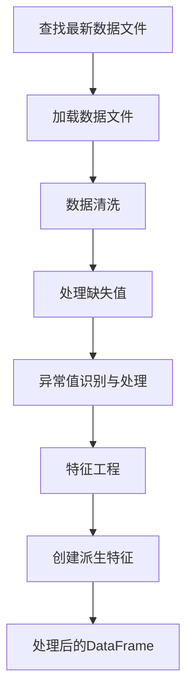
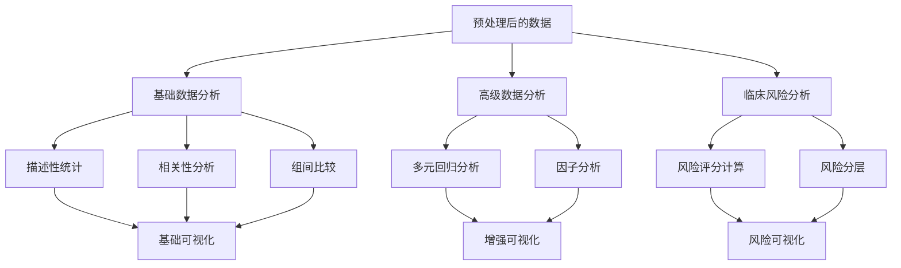
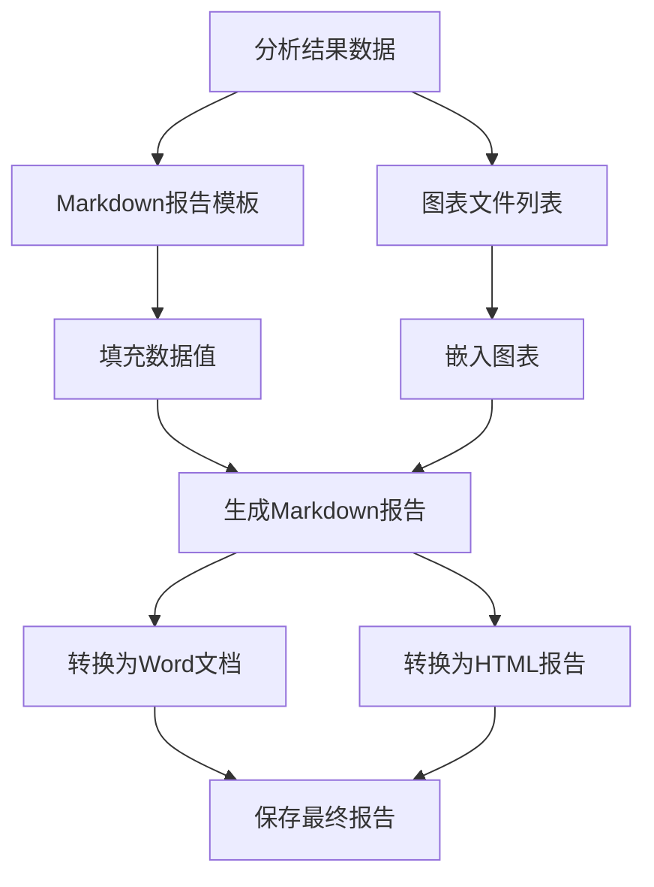
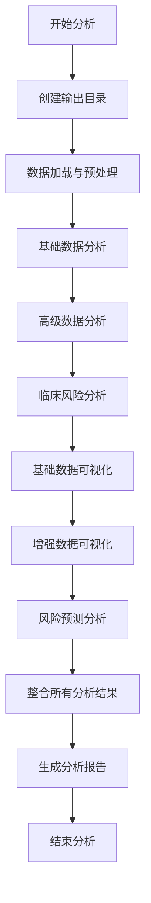

# PWV数据分析流程图

本文档描述了PWV数据分析工具的数据处理流程。

## 整体数据流

```mermaid
flowchart TD
    A[原始Excel数据文件] --> B[数据加载与预处理]
    B --> C[基础数据分析]
    B --> D[高级数据分析]
    B --> E[临床风险分析]
    C --> F[基础数据可视化]
    D --> G[增强数据可视化]
    E --> H[风险预测分析]
    F --> I[报告生成]
    G --> I
    H --> I
    I --> J[Markdown报告]
    I --> K[Excel表格]
    I --> L[Word文档]
    I --> M[HTML报告]
```

## 详细模块流程

### 1. 数据加载与预处理流程

```mermaid
flowchart TD
    A[查找最新数据文件] --> B[加载数据文件]
    B --> C[数据清洗]
    C --> D[处理缺失值]
    D --> E[异常值识别与处理]
    E --> F[特征工程]
    F --> G[创建派生特征]
    G --> H[处理后的DataFrame]
```

### 2. 分析与可视化流程

```mermaid
flowchart TD
    A[预处理后的数据] --> B1[基础数据分析]
    A --> B2[高级数据分析]
    A --> B3[临床风险分析]
    
    B1 --> C1[描述性统计]
    B1 --> C2[相关性分析]
    B1 --> C3[组间比较]
    
    B2 --> D1[多元回归分析]
    B2 --> D2[因子分析]
    
    B3 --> E1[风险评分计算]
    B3 --> E2[风险分层]
    
    C1 --> F1[基础可视化]
    C2 --> F1
    C3 --> F1
    
    D1 --> F2[增强可视化]
    D2 --> F2
    
    E1 --> F3[风险可视化]
    E2 --> F3
```

### 3. 报告生成流程

```mermaid
flowchart TD
    A[分析结果数据] --> B[Markdown报告模板]
    A --> C[图表文件列表]
    B --> D[填充数据值]
    C --> E[嵌入图表]
    D --> F[生成Markdown报告]
    E --> F
    F --> G[转换为Word文档]
    F --> H[转换为HTML报告]
    G --> I[保存最终报告]
    H --> I
```

## 主控脚本执行流程

```mermaid
flowchart TD
    A[开始分析] --> B[创建输出目录]
    B --> C[数据加载与预处理]
    C --> D[基础数据分析]
    D --> E[高级数据分析]
    E --> F[临床风险分析]
    F --> G[基础数据可视化]
    G --> H[增强数据可视化]
    H --> I[风险预测分析]
    I --> J[整合所有分析结果]
    J --> K[生成分析报告]
    K --> L[结束分析]
``` 